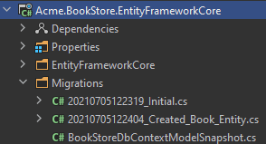
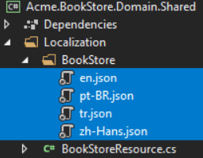

# Tutorial 
Blazor WASM APP
## Outline
- [Section 1](#section-1)
    - [Sub Section](#sub-setion-11)
## Section 1 Set environment
Download ABP CLI for v8.2+
```csharp
dotnet tool install -g Volo.Abp.Studio.Cli
```
Check update
```csharp
dotnet tool update -g Volo.Abp.studio.Cli
```
If you are using ABP earlier than v8.2+, then you are probably using the old ABP CLI and can easily switch to the new CLI by simply uninstalling the old one and installing the new CLI by executing the commands below:
```csharp
# uninstalling the old CLI
dotnet tool uninstall -g Volo.Abp.Cli
# installing the new CLI
dotnet tool install -g Volo.Abp.Studio.Cli
```
If you want old version.
```csharp
# installing the old ABP CLI with v8.0
abp install-old-cli --version 8.0.0
# creating a new solution with v8.0 template and cli version
abp new Acme.BookStore --version 8.0 --old # or you can use `abp-old new Acme.BookStore` command
```
Login Account
```csharp
abp login "name" -p "password"
```
install yarn
```csharp
npm install --global yarn
```
Create your project
```csharp
abp new Acme.BookStore -u blazor -dbms SQLite -m none --theme leptonx-lite -csf
```
```csharp
cd Acme.BookStore
```
Open project and run `*.DbMigrator` project to update database.
```csharp
code .
```
## Section 2 Creating the sever side
### Installing the Client-Side Packages
 Run the `abp install-libs` command on the root directory of your solution to install all required NPM packages:
```csharp
abp install-libs
```
### Bundling and Minification
`abp bundle` command offers bundling and minification support for client-side resources (JavaScript and CSS files) for Blazor projects.
You can run this command in the directory of your `*.Blazor.Client` project:
 ```csharp
 abp bundle
```

### Create the Book Entity

Domain layer in the startup template is separated into two projects:

1.`Acme.BookStore.Domain` contains your entities, domain services and other core domain objects.

2.`Acme.BookStore.Domain.Shared` contains constants, enums or other domain related objects that can be shared with clients.

The main entity of the application is the `Book`. Create a `Books` folder (namespace) in the `Acme.BookStore.Domain` project and add a `Book` class inside it:

```csharp
using System;
using Volo.Abp.Domain.Entities.Auditing;

namespace Acme.BookStore.Books;

public class Book : AuditedAggregateRoot<Guid>
{
    public string Name { get; set; }

    public BookType Type { get; set; }

    public DateTime PublishDate { get; set; }

    public float Price { get; set; }
}
```
### BookType Enum
The `Book` entity uses the `BookType` enum. Create a `Books` folder (namespace) in the `Acme.BookStore.Domain.Shared` project and add a `BookType` inside it:
```csharp
namespace Acme.BookStore.Books;

public enum BookType
{
    Undefined,
    Adventure,
    Biography,
    Dystopia,
    Fantastic,
    Horror,
    Science,
    ScienceFiction,
    Poetry
}
```
The final folder/file structure should be as shown below:

### Add the Book Entity to the DbContext
EF Core requires that you relate the entities with your `DbContext`. The easiest way to do so is adding a `DbSet` property to the `BookStoreDbContext` class in the `Acme.BookStore.EntityFrameworkCore` project, as shown below:
```csharp
public class BookStoreDbContext : AbpDbContext<BookStoreDbContext>
{
    public DbSet<Book> Books { get; set; }
    //...
}
```
### Map the Book Entity to a Database Table

Navigate to the `OnModelCreating` method in the `BookStoreDbContext` class and add the mapping code for the `Book` entity:
```csharp
using Acme.BookStore.Books;
...

namespace Acme.BookStore.EntityFrameworkCore;

public class BookStoreDbContext : 
    AbpDbContext<BookStoreDbContext>,
    IIdentityDbContext,
    ITenantManagementDbContext
{
    ...

    protected override void OnModelCreating(ModelBuilder builder)
    {
        base.OnModelCreating(builder);

        /* Include modules to your migration db context */

        builder.ConfigurePermissionManagement();
        ...

        /* Configure your own tables/entities inside here */

        builder.Entity<Book>(b =>
        {
            b.ToTable(BookStoreConsts.DbTablePrefix + "Books",
                BookStoreConsts.DbSchema);
            b.ConfigureByConvention(); //auto configure for the base class props
            b.Property(x => x.Name).IsRequired().HasMaxLength(128);
        });
    }
}
```
### Add Database Migration
Open a command-line terminal in the directory of the `Acme.BookStore.EntityFrameworkCore` project and type the following command:
```csharp
dotnet ef migrations add Created_Book_Entity
```
This will add a new migration class to the project:



### Add Sample Seed Data
Create a class that implements the `IDataSeedContributor` interface in the `*.Domain` project by copying the following code:
```csharp
using System;
using System.Threading.Tasks;
using Acme.BookStore.Books;
using Volo.Abp.Data;
using Volo.Abp.DependencyInjection;
using Volo.Abp.Domain.Repositories;

namespace Acme.BookStore;

public class BookStoreDataSeederContributor
    : IDataSeedContributor, ITransientDependency
{
    private readonly IRepository<Book, Guid> _bookRepository;

    public BookStoreDataSeederContributor(IRepository<Book, Guid> bookRepository)
    {
        _bookRepository = bookRepository;
    }

    public async Task SeedAsync(DataSeedContext context)
    {
        if (await _bookRepository.GetCountAsync() <= 0)
        {
            await _bookRepository.InsertAsync(
                new Book
                {
                    Name = "1984",
                    Type = BookType.Dystopia,
                    PublishDate = new DateTime(1949, 6, 8),
                    Price = 19.84f
                },
                autoSave: true
            );

            await _bookRepository.InsertAsync(
                new Book
                {
                    Name = "The Hitchhiker's Guide to the Galaxy",
                    Type = BookType.ScienceFiction,
                    PublishDate = new DateTime(1995, 9, 27),
                    Price = 42.0f
                },
                autoSave: true
            );
        }
    }
}
```
### Update the Database
Run the `Acme.BookStore.DbMigrator` application to update the database
### Create the Application Service
The application layer is separated into two projects:

1.Acme.BookStore.Application.Contracts contains your DTOs and application service interfaces.

2.Acme.BookStore.Application contains the implementations of your application services.
### BookDto
Create a `Books` folder (namespace) in the `Acme.BookStore.Application.Contracts` project and add a `BookDto` class inside it:
```csharp
using System;
using Volo.Abp.Application.Dtos;

namespace Acme.BookStore.Books;

public class BookDto : AuditedEntityDto<Guid>
{
    public string Name { get; set; }

    public BookType Type { get; set; }

    public DateTime PublishDate { get; set; }

    public float Price { get; set; }
}
```
DTO classes are used to transfer data between the presentation layer and the application layer.

It will be needed to map the `Book` entities to the `BookDto` objects while returning books to the presentation layer. AutoMapper library can automate this conversion when you define the proper mapping. The startup template comes with AutoMapper pre-configured. So, you can just define the mapping in the `BookStoreApplicationAutoMapperProfile` class in the `Acme.BookStore.Application` project:
```csharp
using Acme.BookStore.Books;
using AutoMapper;

namespace Acme.BookStore;

public class BookStoreApplicationAutoMapperProfile : Profile
{
    public BookStoreApplicationAutoMapperProfile()
    {
        CreateMap<Book, BookDto>();
    }
}
```
### CreateUpdateBookDto
Create a `CreateUpdateBookDto` class in the `Books` folder (namespace) of the `Acme.BookStore.Application.Contracts` project:
```csharp
using System;
using System.ComponentModel.DataAnnotations;

namespace Acme.BookStore.Books;

public class CreateUpdateBookDto
{
    [Required]
    [StringLength(128)]
    public string Name { get; set; } = string.Empty;

    [Required]
    public BookType Type { get; set; } = BookType.Undefined;

    [Required]
    [DataType(DataType.Date)]
    public DateTime PublishDate { get; set; } = DateTime.Now;

    [Required]
    public float Price { get; set; }
}
```
As done to the `BookDto` above, we should define the mapping from the `CreateUpdateBookDto` object to the `Book` entity. The final class will be as shown below:
```csharp
using Acme.BookStore.Books;
using AutoMapper;

namespace Acme.BookStore;

public class BookStoreApplicationAutoMapperProfile : Profile
{
    public BookStoreApplicationAutoMapperProfile()
    {
        CreateMap<Book, BookDto>();
        CreateMap<CreateUpdateBookDto, Book>();
    }
}
```
### IBookAppService
Next step is to define an interface for the application service. Create an `IBookAppService` interface in the `Books` folder (namespace) of the `Acme.BookStore.Application.Contracts` project:
```csharp
using System;
using Volo.Abp.Application.Dtos;
using Volo.Abp.Application.Services;

namespace Acme.BookStore.Books;

public interface IBookAppService :
    ICrudAppService< //Defines CRUD methods
        BookDto, //Used to show books
        Guid, //Primary key of the book entity
        PagedAndSortedResultRequestDto, //Used for paging/sorting
        CreateUpdateBookDto> //Used to create/update a book
{

}
```
### BookAppService
t is time to implement the `IBookAppService` interface. Create a new class, named `BookAppService` in the `Books` namespace (folder) of the `Acme.BookStore.Application` project:
```csharp
using System;
using Volo.Abp.Application.Dtos;
using Volo.Abp.Application.Services;
using Volo.Abp.Domain.Repositories;

namespace Acme.BookStore.Books;

public class BookAppService :
    CrudAppService<
        Book, //The Book entity
        BookDto, //Used to show books
        Guid, //Primary key of the book entity
        PagedAndSortedResultRequestDto, //Used for paging/sorting
        CreateUpdateBookDto>, //Used to create/update a book
    IBookAppService //implement the IBookAppService
{
    public BookAppService(IRepository<Book, Guid> repository)
        : base(repository)
    {

    }
}
```
## Section 3 The Book List Page
### Localization
Localization texts are located under the `Localization/BookStore` folder of the `Acme.BookStore.Domain.Shared` project:

```csharp
{
  "Culture": "en",
  "Texts": {
    "Menu:Home": "Home",
    "Welcome": "Welcome",
    "LongWelcomeMessage": "Welcome to the application. This is a startup project based on the ABP. For more information, visit abp.io.",
    "Menu:BookStore": "Book Store",
    "Menu:Books": "Books",
    "Actions": "Actions",
    "Close": "Close",
    "Delete": "Delete",
    "Edit": "Edit",
    "PublishDate": "Publish date",
    "NewBook": "New book",
    "Name": "Name",
    "Type": "Type",
    "Price": "Price",
    "CreationTime": "Creation time",
    "AreYouSure": "Are you sure?",
    "AreYouSureToDelete": "Are you sure you want to delete this item?",
    "Enum:BookType.0": "Undefined",
    "Enum:BookType.1": "Adventure",
    "Enum:BookType.2": "Biography",
    "Enum:BookType.3": "Dystopia",
    "Enum:BookType.4": "Fantastic",
    "Enum:BookType.5": "Horror",
    "Enum:BookType.6": "Science",
    "Enum:BookType.7": "Science fiction",
    "Enum:BookType.8": "Poetry"
  }
}
```


#### Sub-setion 11
fjid
#### Sub-setion 11
fijasdf
#### Sub-setion 11
fjidsaf
#### Sub-setion 12
fjidsafj
#### Sub-setion 13
fijdafij
```pwsh
cd $HOME
```
### Section 2
### Section 3

```csharp
var number = 10;
```

|NAME|DESCRIPTION|STATUS|
|-|-|-|
|Ezra|Handsome|Sick|
|Eason|||
||||
```csharp

```