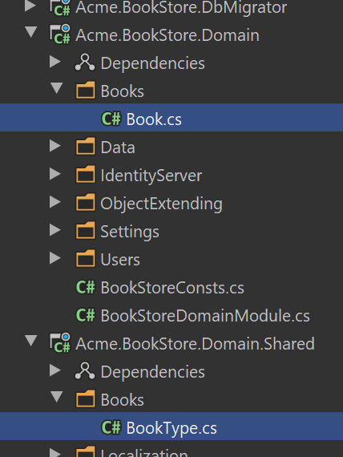

# Tutorial 
Blazor WASM APP
## Outline
- [Section 1](#section-1)
    - [Sub Section](#sub-setion-11)
## Section 1 Set environment
Download ABP CLI for v8.2+
```csharp
dotnet tool install -g Volo.Abp.Studio.Cli
```
Check update
```csharp
dotnet tool update -g Volo.Abp.studio.Cli
```
If you are using ABP earlier than v8.2+, then you are probably using the old ABP CLI and can easily switch to the new CLI by simply uninstalling the old one and installing the new CLI by executing the commands below:
```csharp
# uninstalling the old CLI
dotnet tool uninstall -g Volo.Abp.Cli
# installing the new CLI
dotnet tool install -g Volo.Abp.Studio.Cli
```
If you want old version.
```csharp
# installing the old ABP CLI with v8.0
abp install-old-cli --version 8.0.0
# creating a new solution with v8.0 template and cli version
abp new Acme.BookStore --version 8.0 --old # or you can use `abp-old new Acme.BookStore` command
```
Login Account
```csharp
abp login "name" -p "password"
```
install yarn
```csharp
npm install --global yarn
```
Create your project
```csharp
abp new Acme.BookStore -u blazor -dbms SQLite -m none --theme leptonx-lite -csf
```
```csharp
cd Acme.BookStore
```
Open project and run `*.DbMigrator` project to update database.
```csharp
code .
```
## Section 2 Creating the sever side
### Installing the Client-Side Packages
 Run the `abp install-libs` command on the root directory of your solution to install all required NPM packages:
```csharp
abp install-libs
```
### Bundling and Minification
`abp bundle` command offers bundling and minification support for client-side resources (JavaScript and CSS files) for Blazor projects.
You can run this command in the directory of your `*.Blazor.Client` project:
 ```csharp
 abp bundle
```

### Create the Book Entity

Domain layer in the startup template is separated into two projects:

1.`Acme.BookStore.Domain` contains your entities, domain services and other core domain objects.
2.`Acme.BookStore.Domain.Shared` contains constants, enums or other domain related objects that can be shared with clients.

The main entity of the application is the `Book`. Create a `Books` folder (namespace) in the `Acme.BookStore.Domain` project and add a `Book` class inside it:

```csharp
using System;
using Volo.Abp.Domain.Entities.Auditing;

namespace Acme.BookStore.Books;

public class Book : AuditedAggregateRoot<Guid>
{
    public string Name { get; set; }

    public BookType Type { get; set; }

    public DateTime PublishDate { get; set; }

    public float Price { get; set; }
}
```
### BookType Enum
The `Book` entity uses the `BookType` enum. Create a `Books` folder (namespace) in the `Acme.BookStore.Domain.Shared` project and add a `BookType` inside it:
```csharp
namespace Acme.BookStore.Books;

public enum BookType
{
    Undefined,
    Adventure,
    Biography,
    Dystopia,
    Fantastic,
    Horror,
    Science,
    ScienceFiction,
    Poetry
}
```

### Add the Book Entity to the DbContext
EF Core requires that you relate the entities with your `DbContext`. The easiest way to do so is adding a `DbSet` property to the `BookStoreDbContext` class in the `Acme.BookStore.EntityFrameworkCore` project, as shown below:
```csharp
public class BookStoreDbContext : AbpDbContext<BookStoreDbContext>
{
    public DbSet<Book> Books { get; set; }
    //...
}
```


#### Sub-setion 11
fjid
#### Sub-setion 11
fijasdf
#### Sub-setion 11
fjidsaf
#### Sub-setion 12
fjidsafj
#### Sub-setion 13
fijdafij
```pwsh
cd $HOME
```
### Section 2
### Section 3

```csharp
var number = 10;
```

|NAME|DESCRIPTION|STATUS|
|-|-|-|
|Ezra|Handsome|Sick|
|Eason|||
||||
```csharp

```